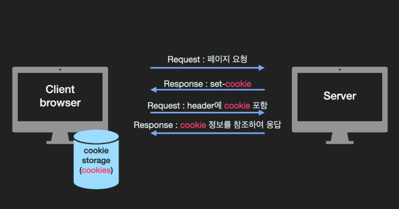
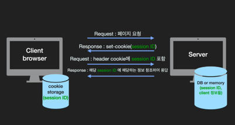
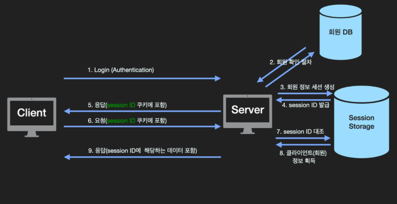

### 쿠키와 세션의 차이 (서버 관점)

* 쿠키는 클라로컬에 key-value로 저장되는 데이터 파일로
* 유효시간내에서는 브라우저가 종료되어도 계속 유지

* 세션은 브라우저가 종료되거나, 서버에서 해당 세션을 삭제할 수 잇기에 쿠키보다 보안성이 좋음
* 또한 서버에 데이터를 저장하므로 서버 용량이 허용하는 한에서는 제한 없이 데이터를 저장할 수 있다는 장점이 있지만 서버의 부하가 커진다는 단점

### connectionless, stateless
* 쿠키와 세션을 사용하는 이유는 Http의 connectionless(비연결성), stateless(비상태성)이라는 특징 때문.
* 클라가 요청시 그 요청에 맞는 응답을 보낸 후 연결을 끊고 - request header에 keep-alive 값을 통해 connection 을 끊지 않고 유지 할수 잇다.
* 서버는 클라에대한 상태를 유지하지 않기에 알 수 없다.

* 만약 쿠키와 세션을 사용하지 않는다면 해당 페이지 로그인 했음에도 페이지 이동마다 계속 로그인을 해야함.

### 쿠키
> 쿠키의 생성과 저장은 구현에 따라 다르지만 원리는 동일하다.

1. 서버가 클라로부터 요청을 받았을때, 클라에 관한 정보를 토대로 쿠키를 구성.
2. 서버는 클라에게 보내는 응답을 헤더에 쿠키를 담아 보냄
3. 클라가 응답 받으면 브라우저는 쿠키를 쿠키디렉터리에 저장

쿠키는 클라(브라우저) key-value쌍으로 로컬에 저장되는 데이터 파일.
유효시간 내 브라우저가 종료되어도 계속 유지.
서버에서 response header에 set-cookie 속성을 사용해 클라에게 쿠키를 만들고, 사용자가 따로 작업을 하지 않아도 
브라우저가 쿠키를 requset header에 담아 서버에 전송.

### 세션
> 기본적으로 쿠키를 이용해 구현이 됨.     
> 클라이언트를 구분하기 위해 각 클라에게 session ID를 부여하고 클라이언트는 쿠키에 session ID를 저장해둠

사용자 정보를 브라우저에 저장하는 쿠키와 달리 세션은 서버측에 저장하여 관리함.   
세션은 유효시간을 두어 일정 시간 응답이 없다면 끊을 수 있고, 브라우저가 종료될 때까지 인증상태 유지 가능.    
사용자 정보를 서버에 두기에 쿠키보다 보안성은 좋지만 서버 자원을 차지하기에 서버에 과부화를 줄 수 있고 성능 저하의 요인이 될 수 있다.

### 쿠키와 세션을 이용한 로그인 방식!!

> HTTP는 비연결성, 비상태성 특성을 지녀 서버는 클라가 로그인 했더라도    
> 이후 요청때마다 해당 클라가 로그인 했었는지 알 수 없다.     
> 하지만 쿠키와 세션을 활용하면 로그인 상태를 유지 가능      
> 쿠키와 세션을 이용하여 어떤 절차로 로그인이 되고 상태 저장되는지 이해하기!!!!     

## 쿠키와 세션을 통한 인증(authentication)과 인가(authorization)

### 인증(authentication)
인증(authentication) 은 사용자가 누구인지 확인하는 절차이다.   
회원가입과 로그인 과정이 인증의 대표적 예시이다.

### 인가(authorization)
인가(authorization)는 사용자가 요청하는 것에 대한 권한이 있는지를 확인하는 절차이다.   

### 세션을 통한 인증, 인가는 다음과 같다.
1. 클라가 로그인 하면 서버는 회원 정보를 대조해 인증을 한다 - authentication
2. 회원정보(클라정보)를 세션 저장소에 생성하고 session id 발급
3. http response header 쿠키에 발급한 세션아이디 를 담아 보낸다.
4. 클라에서는 session id를 쿠키저장소에 저장하고 이후 http request를 보낼때마다 쿠키에 session id를 담아 보냄.
5. 서버에서 쿠키에 담겨져온 세션아이디에 해당하는 회원 정보를 세션 저장소에서 가져옴 - authorization
6. 응답 메시지에 회원정보를 바탕으로 처리된 데이터를 담아 클라에게 보냄.

* 사용자가 로그인을 하면 서버는 session id를 쿠키로 클라에게 보냄.
* 클라는 세션아디를 요청시마다 헤더에 담아 보내면
* 서버는 세션아디에 해당하는 클라 정보를 세션저장소에서 가져옴
* 이를 통해 클라정보에 따라 맞춤 응답 가능
* 하지만 서버에서 세션저장소를 사요앻 사용자 정보를 저장해야하기에 추가적인 저장공간을 필요로함
* session id만 쿠키에 담겨 요청을 보내기에 요청마다 사용자 정보를 쿠키에 담아 전송하는것보단 안전
* 하지만 세션아디만 노출되어 악의를 가진 다른 사용자가 이를 이용해 서버에 요청하면
* 서버는 구별해낼 방법이 없음.
* 이를 session hijacking이라고 함.
* 해결책으로는 https를 이용하거나 session 에 짧은 주기로 만료시간을 설정하는 방법이 있음
* 또한 세션과 쿠키를 이용한 로그인 방식은 load balancing 및 서버 효율성 관리 및 확장이 어려워 질 수 있다는 단점
  * => 여러 대의 서버를 이용하는 시스템인 경우 유저 로그인시 해당 유저는 처음 로그인 했던 서버로만 요청을 보내도록 설정해야하기 때문

### 브라우저 로컬 vs 세션 vs 쿠키
* 로컬스토리지
  * 로컬 스토리지는 저장한 데이터를 지우지 않는 이상 영구적 보관 가능(도메인마다 별도로 로컬 스토리지가 생성)
  * 최대 크기는 5mb
  * 사용예시: 로그인
* 세션스토리지
  * 세션 종류시 클라에 대한 정보가 삭제
  * 최대 크기는 5mb
  * 사용예시: 입력 폼 정보, 비로그인 바구니
* 쿠키
  * 웹사이트에서 쿠키를 설정하면, 모든 웹(해당 도메인) 요청에는 쿠키정보가 포함됨 => 서버 부담 증가
  * 최대크기: 4kb
  * 사용예시: 팝업창
  * 