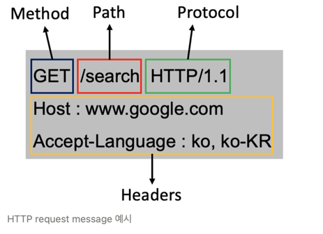
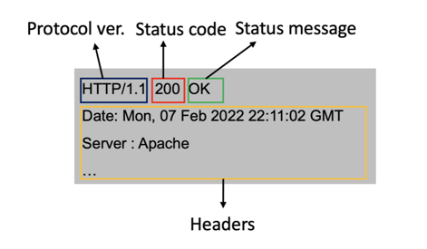
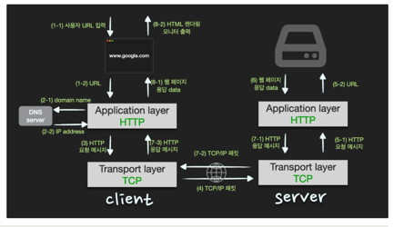

### HTTP
> HyperText Transfer Protocol

웹상에서 정보를 전송하기 위한 통신 프로토콜로 HTML과 같은 문서를 전송하는것에 사용된다.

* 클라가 http request를 서버에 보내면
* 서버는 http response를 클라에게 보내주는 구조다.

* request message는 
  * start line(method, path, http version)
  * headers
  * body
* 로 이뤄짐
* 
* reponse message는
  * status line(http version, status code, status message)
  * headers
  * body
    
* 로 이뤄짐
* http는 서버연결후 요청에 응답을 받으면 연결을 끊어버리는 connectionless특성을 갖는다.
* 리오 인해 많은 사람이 웹을 이용해도 실제 동시 접속을 최소화 하여 더 많은 유저의 요청을 처리할 수 있다.
* 하지만 연결을 끊었기에 클라이언트의 이전상태(로그인 유무등)을 알수 없다는 stateless특성이 생김.
* 정보를 유지할 수 없는 conectionless, stateless 특성을 가진 http 의 단점을 해결하기위해 
* cookie, session, jwt등이 도입됨
* 또한 http는 정보를 text형식으로 주고받기에 중간에 인터셉트할 경우 데이터 유출이 발생할 수 잇는 문제가 있어
* 이를 해결하고자 http에 암호화를 추가한 프로토콜이 바로 https이다.

### Get vs Post
* get은 클라가 서버에게 리소스 요청시 사용
* get 요청의 경우 필요 정보를 특정하기 위해 url뒤에 query string을 추가해 정보 조회
* get은 url뒤에 queryString까지 포함해 브라우저 히스토리에 남고 캐시가 가능
* 캐시 - 한번 접근후, 같은 요청시 빠르게 접근하기위해 데이터를 저장해 놓는다.
* post는 서버에게 데이터처리(주로 생성)을 요청시 사용
* post 요청의 경우 전달시 body에 데이터를 포함
* 브라우저에 히스토리 남지 않고 캐시도 불가능

## Get
* 클라가 서버에게 정보 요청시 사용
* url에 key-value 쌍으로 파라미터를 포함해 전송 이부분을 쿼리스트링이라함
* 캐시가 가능한데 - 
  * 한번 서버에 겟 요청을 한적이 있다면 브라우저가 그 결과를 저장해둔다. 이후 동일한 요청은 브라우저에 저장된 값으로 가져올 수 잇다.

## Post
* 클라가 바디를 통해 전달한 데이터를 서버가 처리하도록 하는 요청
* 서버는 post 메시지를 받으면 꼭 리소스를 등록하는것만 아니라 리소스마다 다양하게 처리
* 데이터 생성, 변경, 특정프로세스 처리
  * put: 리소스 대체, 해당 리소스 없으면 생성 - 없는값은 null로 바꿔버림
  * patch: 리소스 일부 수정 - 없는값은 기존 값 그대로 둠

## 주소창 주소 입력시 화면 나오는데 까지 네트워크 관점의 과정
1. 사용자가 url 입력
2. 브라우저는 dns를 통해 서버의 Ip주소 찾음
3. 클라에서 http request메시지 -> tcp/ip 패킷 생성 -> 서버로 전송
4. 서버에서 http request에 대한 http response메시지 -> tcp/ip 패킷 생성 -> 클라 전송
5. 도착한 http response메시지는 웹브라우저에 의해 출력(렌더링)

( 사용자가 입력한 URL이 어떻게 IP로 변환되는지,    
request 메세지가 전달되는 절차와 앞서 살펴본     
HTTP protocol,과 TCP protocol을 거쳐서 패킷이 되는 과정,     
request 메세지를 받은 서버에서는 HTTP response message를 구성하여 client로 전송하는 것      
등을 절차에 맞게 순차적으로 설명하면 됩니다.)

### 웹뷰 동작방식
1. 유저가 주소를 입력하면 http reqeust message 생성
2. ip주소를 알아야 전송가능하기에 dns lookup을 통해 해당 도메인의 server ip주소를 알아낸다
3. 반환된 ip 주소 (입력한 도메인의 서버 ip)로 http requset message를 전송 요청
4. 생성된 http 요청 메시지를 tcp/ip 층에 전달
5. http 요청 메시지에 헤더를 추가해 tcp/ip 패킷을 생성
6. 해당 패킷은 전기신호로 랜선을 통해 네트워크로 전송, 목적지 ip 에 도달
7. 도메인 서버에 도착한 패킷은 unpacking을 통해 message를 복원하고 server의 process로 보낸다.
8. 서버의 프로세스는 http 요청 메시지에 대한 response data를 가지고 http response message를 생성
9. http response message를 전달받은 방식 그대로 client ip로 전송
10. http response메시지에 담긴 데이터를 토대로 웹브라우저에서 html 렌더링을 하여 모니터에 보여
11. 