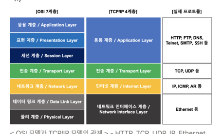

### TCP/IP

* osi 7계층과 tcp/ip 4계층
* osi 7계층은 네트워크 통신을 표준화 한 모델로, 통신 시스템을 7단계로 나누어 설명한것
* osi모델이 실무적으로 이용하기에 복잡해 실제 인터넷에서는 이를 단순화 한 tcp/ip 4계층 사용.

* tcp/ip 4계층 모델에서 각 계층은 하위 계층의 기능을 이용하고, 상위 계층에게 기능을 제공
* 예를 들어 http는 tcp과 ip을 이용해 작동
* 일반적으로 상위 계층의 프로토콜은 소프트웨어로, 하위계층의 프로토콜은 하드웨어로 구현됨
* ex) 물리계층의 통신은 케이블을 통한 전기신호로 이뤄짐
* 

### TCP vs UDP
* tcp는 연결형, 신뢰성 전송 프로토콜
* 연결지향적 서비스를 제공하기위해 데이터를 전송하기전 3way handshaking을 하여 두 호스트의 전송계층 사이에 논리적 연결을 설립.
* 신뢰성 있는 서비스를 제공하기 위해 오류제어, 흐름제어, 혼잡제어등 실행
* 신뢰성을 보장하기 위해 Header 가 더 크고 속도가 비교적 느리다는단점

* udp는 비연결형 프로토콜로 3-way shake등의 세셴 수립과정이 없다.
* 또한 비신뢰성 프로토콜로 흐름제어, 오류제어, 혼잡제어를 제공하지 않는다.
* 이 단순성덕분에 적은양의 오버헤드 갖고 수신여부를 확하지 않아 속도가 빠르다

* tcp는 신뢰성이 중요한 http, file전송 등에 쓰임
* udp는 실시간성이 중요한 동영상 스트링등 에 주로 사용

### 3way handshake란?
* tcp/ip 프로토콜로 통신전 정확한 정보전송을 위해
* 상대방 컴퓨터와 세션을 수립하는 (연결하는) 과정 - tcp 연결 초기화

* 클라가 서버에게 접속을 요청하는 syn패킷을 보내면 서버는 요청을 수락하는 ack를 포함해 syn+ack 패킷을 클라에게 발송
* 클라가 이것을 수신후, 다시 ack를 서버에 발송하며 ㄴ연결이 이뤄지고 이로써 데이터를 주고 받을 수 있다.
