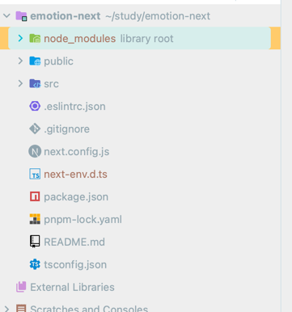

     
먼저 구성 자체는 lock 파일빼곤 똑같아 보이는디    
공식문서에 따르면 npm과 달리 모든 옵션의 유효성을 검사한다.    
`pnpm install --target_arch x64` 은 `--target_arch`가 `pnpm install` 에 유효한 옵션이 아니기에 실패할것이다.

그러나 일부 의존성 패키지는 `npm_config_` 환경변수를 사용할 수도 있다. 이는 cli 옵션을 통해 주어져야한다. 아래와 같은 옵션이 있다.
1. 환경변수를 명시적으로 설정한다. `npm_config_target_arch=x64 pnpm install`
2. 옵션을 `--config.`를 토앻 설정한다. `pnpm install --config.target_arch=x64`
