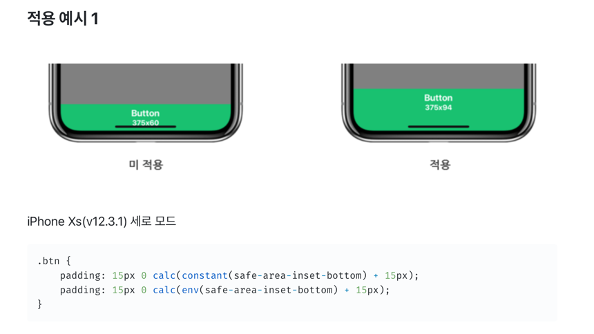

```jsx
padding-top: env(safe-area-inset-top);
```

이게 뭔가 해서 찾아봤다.

<aside>
👨‍🦲 아이폰 X부터 노치 영역의 문제 때문에 생긴거!

</aside>

노치에서 가려지는 문제를 해결하기 위해

- html 소스에 viewport의 content속성에 viewport-fit=cover를 넣어줘야한다 (viewport-fit의 기본 값은 auto이다.)
  `<meta name="viewport" content="viewport-fit=cover">`
- css 에서는 env()속성을 적용해주는건데

    ```jsx
    /* iOS 11.0 버전 */
    constant(safe-area-inset-top)
    constant(safe-area-inset-right)
    constant(safe-area-inset-bottom)
    constant(safe-area-inset-left)
    
    /* iOS 11.2 이상 */
    env(safe-area-inset-top)
    env(safe-area-inset-right)
    env(safe-area-inset-bottom)
    env(safe-area-inset-left)
    ```

  ios의 버전에 따라 입력되는 속성이 다른데 ios11.0버전에선 constant속성을, iOS11.2이상부터는 env로 대체되었다.


`.nav{right: 0;}`

`.nav{right:0; right:constant(safe-area-inset-right); right:env(safe-area-inset-right);}`

```jsx
padding-top: env(safe-area-inset-top);
```

이게 뭔가 해서 찾아봤다.

<aside>
👨‍🦲 아이폰 X부터 노치 영역의 문제 때문에 생긴거!

</aside>

노치에서 가려지는 문제를 해결하기 위해

- html 소스에 viewport의 content속성에 viewport-fit=cover를 넣어줘야한다 (viewport-fit의 기본 값은 auto이다.)
  `<meta name="viewport" content="viewport-fit=cover">`
- css 에서는 env()속성을 적용해주는건데

    ```jsx
    /* iOS 11.0 버전 */
    constant(safe-area-inset-top)
    constant(safe-area-inset-right)
    constant(safe-area-inset-bottom)
    constant(safe-area-inset-left)
    
    /* iOS 11.2 이상 */
    env(safe-area-inset-top)
    env(safe-area-inset-right)
    env(safe-area-inset-bottom)
    env(safe-area-inset-left)
    ```

  ios의 버전에 따라 입력되는 속성이 다른데 ios11.0버전에선 constant속성을, iOS11.2이상부터는 env로 대체되었다.




```css
.nav {
    right: 0;
}

.nav{
    padding: 15px 0 calc(constant(safe-area-inset-bottom) + 15px);
    padding: 15px 0 calc(env(safe-area-inset-bottom) + 15px);
}

```