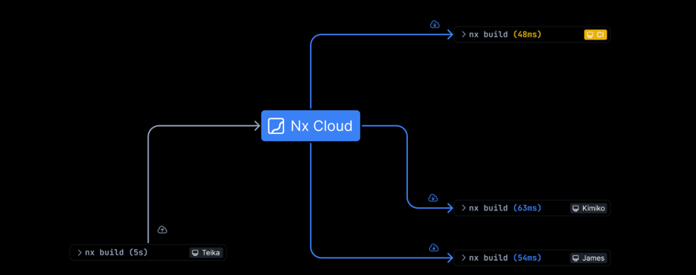

### 모노레포의 빌드 시스템 도구는 무엇을 사용 할 것인가?
> 패키지 매니저만으로 모노레포를 운영이 가능하겠지만 프로젝트가 얼마나 커질지도 모를것이고 커지게 된다면 느려진 모노레포에 대해서 관리가 어려울 것이기에 이가 필요할 것이다.
> (test 실행 및 실해을 조율하는 기능, 결과를 캐싱하는 방식)

### 빌드시스템 도구의 역할
> 작업의 선후 관계를 정의해 수행하고, 캐싱을 통해 작업 실행 속도를 높이는 이유로 모노레포에서 도구를 사용한다.
> 
* 작업 수행 속도를 높여 생산성에 도움을 주고, 패키지를 분석하는 도구를 제공하며, 기타 여러 패키지를 관리할 때 도움이 되는 기능을 준다.
* 모노레포 빌드시스템도구는 모노레포를 운영하며 작업 수행 속도를 높여 생산성에 도움을 주고, 패키지를 분석하는 도구를 제공하며, 기타 여러패키지를 관리 시 도움이 되는 기능을 가지고 있다.
* 도구 없이 운영은 가능하나 성능 이슈가 발생할 수 있고 여러 패키지 관리시 불편한 부분이 발생할 수 있다.
*도구에 의존하면 러닝커브가 있다는 단점이 있을것이다.
* 대표적인 예로 Lerna, Nx, Rush, Turborepo가 있다.
* 
### Lerna:
동일한 레포에서 여러 js/ts 패키지를 관리하고 게시할 수 있는 빠르고 모던한 빌드시스템
여러 기능들을 nx의 기능으로 실행하기에 밀접하게 함께 사용되는데(지원을 중단 했다가 nx를 만드는 사람이 lerna를 계속 유지 관리하기로해 기존 러나의 기능에 nx의 기능이 추가된 형태로 변했다. - 태스크관리 캐싱기능)
여러 패키지를 관리하고 게시하는 기능으로 많은 오픈소스 프로젝트에서 사용됨(패키지 게시, 패키지 변경사항 체크, 릴리즈 노트 자동생성등)
모노레포안에 수백,수천개의 패키지를 보유할 수 있기에 모든(또는 일부) 프로젝트에 대해 스크립트를 실행할 수 있는것은 핵심기능이다.
모든패키지에 스크립트 실행(lerna run test), 특정 패키지에 스크립트 실행(lerna run test --scope=a), 모든 패키지에 여러 스크립트 실행(lerna run test, build), 스크립트 순서가 필요하면 nx의 기능을 이용.
작업의 결과를 캐싱할 수 있다. 의도적인 변화가 있을때만 작업을 재실행하는 기능은 nx를 이용함(leran add-caching)
캐싱을 할 스크립트를 지정할 수 있고 nx.sjon에 내용이 있음
캐싱의 출력물을 지정하면 삭제하더라도, 패키지가 변하지 않으며 다시 생성하는 과정을 거치지 않고 캐싱으로 부터 바로 생성됨 => 빠름
캐시를 여러 머신에 분산이 가능함. 직접 구현 가능하지만 nx cloud 를 이용하면 별도의 구성없이 쉽게 사용이 가능. 오픈소스 프로젝트에선 무료.(nx connect-to-nx-cloud)
모노레포안에 있는 모든 패키지간의 의존성 그래프를 생성 nx의 기능으로 인터렉팁브함(nx graph)
모노레포의 핵심이 수정돼 모든 작업ㅇ르 ci에서 실행해야하는 경우 성능 개선할 수 있는 유일한 방법은 에이전트 작업을 더 추가하고, 작업을 효율적으로 병렬화 하는것으로 nx cloud에 연결하고(nx connect-to-nx-cloud) , ci 에서 dte 를 활성화 한다.(nx generate @nrwl/workspace:ci-worflow --ci=github)
npm 에 패키지 게시가 가능함
ide plugin 이 있어 사용이 용이함
파일 변경 체크 가능한 명령어가 제공됨.
모노레포 운영하며 여러 패키지 게시할 때 편리한 도구
nx와 함께 관리되며 nx로 부터 많은 기능을 도입받음.
nx의 사용방식을 그대로 사용하며 nx를 사용하게 되면 도움이됨.
새로 시작하는 프로젝트의 경우에는 러나보단 nx를 사용하는게 유리함.

### nx: 
최고수준의 모노레포 지원과 강력한 통합 기능을 갖춘 차세대 빌드시스템
현재 가장 많은 기능을 제공하는 모노레포 도구로 개발자 생산성 향상, ci 성능 최적화, 코드 품질 유지를 위한 최고 수준의 도구
오픈소스이며 nx cloud 유료상품으로 원격 캐싱 및 분산 태스크 수행과 같은 수준 높은 기능을 간편하게 제공.
버전이 올라가면 사용법이 추가되거나 바뀔수 있음. 설정을 다양하고 세밀하게 가능함.(사용자가 어캐 사용하는것인지에 대한 방향성이 중요함)
단일 워크스페이스 혹은 전체 워크스페이스들에 대한 테스크 수행 명령어를 가짐, 단일 워크스페이스 테스크 실행(nx build my-app), 전체 워크스페이스들에 대한 테스크 실행(nx run-many -t build), 전체 워크스페이스들에 대한 여러 태스크 실행(nx run-many -t build test)
주요기능으로는 캐싱기능을 제공함. 태스크 실행 명령어를 실행하면 여러 방식의 설정 파일로 부터 캐싱을 어캐 하는지 체크함
nx.json/ project.json/ pacakge.json 등을 이용해 설정함.
러나랑 비슷함

유료기능인 nx cloud 를 활용하면 손쉽게 사용 가능
레포의 핵심이 수정되어 모든 작업을 ci에서 실행해야하는 경우, 성능을 개선할 수 있는 유일한 방법은 에이전트 작업을 더 추가하고 
작업을 효율적으로 병렬화 하는것으로 nx cloud에 연결하고(nx connect-to-nx-cloud) , ci 에서 dte 를 활성화 한다.(nx generate @nrwl/workspace:ci-worflow --ci=github)
모노레포안의 모든 패키지간의 의존성 그래프 생성 가능
사용하는 패키지 버전들을 업데이트 하거나, 여러가지 도구들의 설정을 업뎃하거나 심지어 소스코드도 마이크레이션을 자동으로 수행
코드 분석을 사용해 프로젝트가 서로의 잘 정의된 공용 api 에만 의존할 수 있도록 함
프로젝트가 서로 의존할 수 있는 방식에 선언적으로 제약을 가할 수 있음.
lint 설정을 이용해 선언적으로 설정한 내용을 바탕으로 제약을 가할 수 있음.
ide 플로그인 제공
공통적으로 사용가능한 실행기나 코드를 생성해내는 생성기를 플러그인으로 작성하고 서로 공유 가능.
강력한 기능들을 가진 모노레포 빌드 시스템으로
간단히 사용할 수 있고, 수많은 세부 옵션을 이용해 프로젝트를 세밀하게 설정이 가능하다
캐싱과 오케스트레이션을 위한 좋은 도구이고, 메이커가 직접 제공하는 클라우드 서비스를 통해 원격 캐싱과 분산 작업 수행이 가능
업데이트가 빠르게 이뤄지고 이씅며, 사용 안하는 기능도 많아짐...

### Rush:
확장 가능한 web용 모노레포 매니저
공통 git 레포지토리에서 많은 패키지를 빌드하고 게시하는 js 개발자의 삶을 더 쉽게 만들어주는 모노레포 관리 도구.
마이크로소프트에서 관리하기에 마이크로소프트의 많은 팀이 사용중.
다른 모노레포 도구와 설정이나 동작방식에 차이가 있음
국내에 레퍼런스가 적음
많은 부분이 자동화 되어있고, git 사용을 설정해야 캐싱 기능을 사용할 수 있다.
대규모 프로덕션 모노레포를 유지 관리하는 전문 엔지니어에 의해 구축이 되어 목표는 최고의 개발자 경험 제공이라고 한다ㅏ....
모노레포를 관리하기 위해 병렬 빌드, 하위 집합 빌드, 증분 빌드 및 분산 빌드를 제공
레포 정책을 통해 새로운 패키지 종속성을 승인하기 전 검토 가능.
레포 전체에 일관된 종속성 버전 적용 가능
프로젝트는 독립적인 버전 관리 전략을 사용해 개별적으로 게시 가능
rush의 설치모델은 pnpm 을 활용해 팬덤 디펜던시를 제거함.
lock 파일 탐색기를 사용해 버전 충돌을 시각화 하고 문제 해결이 가능함.
rush 를 사용하면 설치 및 빌드가 완전히 결정론적으로 이루어지도록 보장 가능
rush 엔진 버전도 git 브랜치에 따라 자동 설치됨
사용자 지정 명령이나 옵션을 정의하면 엄격히 검증되며 rush 의 명령줄 도움말의 일부로 문서화됨.
설치, 링크, 빌드, 변경로그생성, 게시 및 버전 범프가 가능한 통합 오케스트레이터로 광범위한 rush stack 도구 및 사례와 통합되도록 설계됨
무료 오픈소스임.
프로젝트 관리를 위해 패키지 매니저를 사용해 자체적으로 의존성을 관리함. 프로젝트의 구조가 다른 툴과 다르게 일반적이지 않음.
rushx를 이용해 패키지 별로 스크립트를 실행하고, rush 를 이용해 전체 패키지의 스크립트를 실행함. 
의존관계를 계산해 불필요한 재빌드를 하지 않는데 git 커밋 이후에 사용이 가능함
국내 사용자 레퍼런스가 적음
### Turborepo
자바스크립트 및 타입스크립트 코드베이스를 위한 고성능 빌드시스템
vercel에서 인수한 빌드 시스템 도구
모노레포에서만 사용하는것이 아님. 모노레포의 경우 npm, yarn classic, yarn berry, pnpm의 워크스페이스와 함께 사용이 가능하지만 Pnpm이랑 찰떡
모노레포환경에서 쉽고 빠르게 개발할 수 있는 빌드 환경 제공이 목표
프로젝트 루트 혹은 각 워크스페이스에 turbo.json 이라는 파일을 이용해 캐싱과 테스크 오케스트레이션을 설정함.
사용자가 빌드한 내용을 기억하고 이미 계산한 내용은 건너뜀(태스크 설정만으로 기본값이 캐싱한다)
타임스탬프가 아닌 파일 내용을 보고 빌드해야할 내용을 파악함
쉬고있는 cpu를 낭비하지 않고, 모든 코어를 최대로 사용해 병렬로 실행할 수 있다.
원격 빌드 캐시를 팀원 및 ci/cd 와 공유해 빌드 속도를 더욱 높일 수 있다.
작업간의 관계를 정의한 다음 turborepo가 빌드할 항목과 시기를 최적화 할 수 있음
모노레포에서 쉽고 빠르게 개발할 수 있는 빌드 환경 제공이 목표
빌드 과정에서 성능 향상을 위한 캐시, 리모트 캐시, 병렬 실행 등의 기능을 쉽게 사용 가능
vercel, aws, paypal, framer 등 많은 기업이 사용중
모든 패키지 매니저와 함께 사용 가능하지만 pnpm 을 권장함
트랜스파일러, 컴파일러
자바스크립트는 여러곳에서 실행이되는데, 실행이 되는곳에서 인식하는 자바스크립트는 차이가 있다.
예를들면 브라우저에서 실행이 될 수 있고, node.js 를 이용해 실행이 될 수 있다. 브라우저도 여러 제조사에서 제공하는 다양한 브라우저가 있고 이들 브라우저는 각자가 이해하는 자바스크립트 문법에 차이가 잇다. 그래서 이런 여러 자바스크립트 실행환경에서 이해하는 자바스크립트 문법이 무엇인지에 대해 목록을 제공하는 사이트도 있다. 
우리가 작성하는 코드는 이제 더이상 브라우저에서 바로 실행하지 않는데, 우리가 실행하고자 하는 브라우저에서 이해할 수 있는 문버으로 변경이 필요함.
이렇게 변경하는 것을 트랜스파일, 컴파일 이라고 함.
babel, typescript, esbuild(go 기반으로 빠른 속도와 번들링 까지 가능한 차세대 트랜스파일러), swc (rust기반 빠른속도 쉬운 사용을 목표로 둠)
프론트엔드 플젝에서 번들러는
작성한 코드는 실행환경에서보다는 우리가 이해할 수 있도록 적절히 파일을 분할하고 구조적으로 작업한다.
모듈 시스템을 이용해 모듈간 연결을 만듬
이렇게 최종적으로 작업한 파일은 브라우저에서 실행하기 위해 함께 묶는 작업을 한다. 이것을 번들링이라 함. 보통 번들링을 하며 최적화를 같이 진행함.
이런 과정을 거친 후 브라우저가 이해할 수 있는 적절한 크기의 파일들(하나 혹 여러개)로 만들어지고 이것을 실행함.
대표적인 번들러로 webpack, rollup(es6기반 라이브러리 번들링에 많이 사용됨), vite(빠른 속도 쉬운 사용법으로 인기를 얻어 현재 유명새), esbuild
우리가 작성한 코드는 실행하고자 하는 브라우저에서 이해할 수 있는 문법으로 변경이 필요로 하고 변경하는것을 트랜스파일 또는 컴파일이라함.
모듈로 분리해 사람이 이해하기 쉽게 구성한다. 각종 의존성을 활용하고 모듈끼리 의존 관계가 있다. 실제로 사용하는 코드는 한데 묶어 한개 혹은 여러개의 파일로 만드는것을 번들링이라함.

### 패키지 매니저 선택 기준

팬덤 디펜던시는 피해야함

yarn berry는 git에 많은 부하를 줄 수 있고, pnp 를 지우너하지 않는 모듈로 인해 문제가 발생하기도 했고 완전한 제로 인스톨은 불가능함.

pnpm 은 노드모듈을 이용한 자연스러운 모듈 사용과 완성도 있는 워크스페이스 기능을 가짐

설치속도 측면에 항상 pnpm이 젤 빠른건 아니지만 빠른경우도 많이 있고, 디스크 용량을 줄일 수 있어 효율적

### 모노레포 빌드시스템 도구 선택 기준

패키지 빌드 단계에서 속도를 높이고, 태스크 의존 관계에 따라 병렬적으로 수행하는것이 대규모 레포에서 중요한 영역.

nx, lerna, turbo, rush  모두 필요 기능은 갖추고 있어 사용법이 편리하고 도구를 사용하는 커뮤니티의 활성화 정도로 선택이 가능할것이다.

국내에 레퍼가 적은 러시를 제외하고 nx 계열에서 가장 강력한 기능을 가진 nx와 turborepo중에 선택하는것이 효율적일것이다.

그래도 버셀에서 만든게 간편한 사용으로 기본적인 성능을 끌어내며 업계를 선두하는 많은 기능을 만들어내서 터보가 좋지 않을까... 라는 생각을 개인적으로 함.

### 앱 및 패키지 개발 도구 선택 기준

MFA 개발을 위해선 웹팩이 선두한거니까 웹팩이 좋지 않을까? 웹팩으로 개발하며 성능이슈는 발생할 수 있다. 성능이 좋은 swc-loader 를 이용해 개선을 하면 좋다고 함. 단 프로덕션 이슈가 있는지 주의 해야함.

패키지르 ㄹ분리해 라이브러리로 만드는 경우가 많은데 이때 빠른 개발 환경이면 종합적으로 편리한 vite을 사용하는게 효율적일것이다. swc 활용해 성능을 더 끌어올릴 수 있다.

